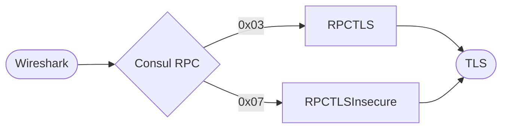
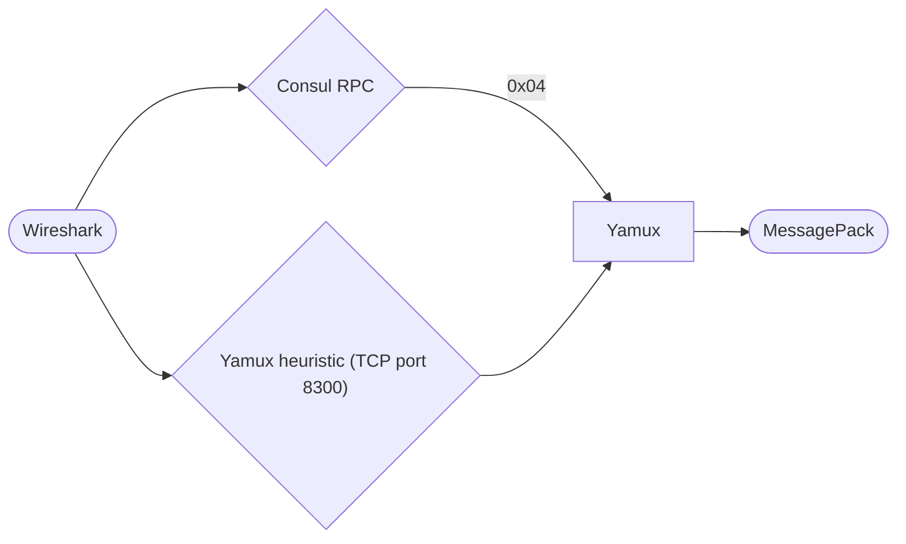
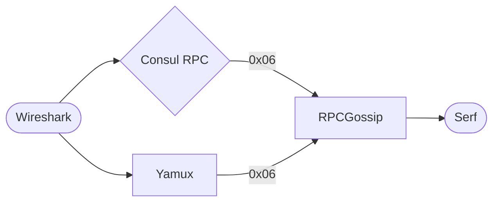
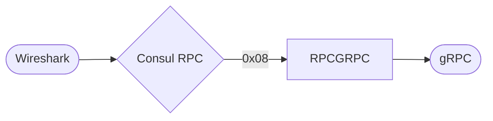

<!--
 Copyright 2022 Blake Covarrubias

 Licensed under the Apache License, Version 2.0 (the "License");
 you may not use this file except in compliance with the License.
 You may obtain a copy of the License at

     http://www.apache.org/licenses/LICENSE-2.0

 Unless required by applicable law or agreed to in writing, software
 distributed under the License is distributed on an "AS IS" BASIS,
 WITHOUT WARRANTIES OR CONDITIONS OF ANY KIND, either express or implied.
 See the License for the specific language governing permissions and
 limitations under the License.
-->

# Dissector packet flow

This plugin is comprised of three distinct protocol dissectors; Consul
(RPC identifier/router), Serf, and Yamux. These dissectors, together with several
built-in Wireshark dissectors, decode traffic related to Consul.

The following diagrams depict how packets for the supported RPC and protocol
types are identified and subsequently dissected by traversing through one or
more dissectors.

## High-level routing

At a high level, the following dissectors are configured to decode traffic
received for specific protocols and/or IP ports.

## Consul RPC router

Consul multiplexes traffic for multiple RPC types on a single TCP port. For each
TCP session, Consul sends a one-byte packet immediately following the three-way
handshake that signals the traffic type that will follow for the duration of the
TCP session.

After identifying a potential RPC byte, the Consul RPC dissector will try to
call a sub-dissector to attempt to decode the RPC byte. Sub-dissectors must be
registered with the `consul.protocol` dissector table to be eligible for
invocation.  If a sub-dissector is found for the specified byte, Wireshark is
notified to use the matching dissector for the remaining packets in the
conversation.

If heuristic detection is enabled, the dissector will attempt to identify
existing traffic in existing TCP sessions by passing packet payloads to each
sub-dissector until one returns a match.

While the majority of the RPC dissectors are called directly from the `consul`
through one of the aforementioned methods, some dissectors can be invoked
directly by other sub-dissectors. The following sections list each
sub-dissector, and the different ways the dissector can be invoked.

### RPCRaft (0x01)

The RPC Raft dissector is invoked directly from the Consul RPC dissector.

### RPCTLS (0x03) / RPCTLSInsecure (0x07)

The RPC TLS and TLS Insecure dissectors are invoked directly from the Consul RPC dissector.

### RPCMultiplexV2 (0x04) / Yamux

The Yamux dissector can be invoked in one of two ways.

1. If heuristic detection is enabled (default), the dissector will be invoked
   for matching TCP packets.
1. The Consul RPC router forwards packets for RPC type `0x04` to the sub-dissector.

### RPCSnapshot (0x05)

The RPC Snapshot dissector is invoked directly from the Consul RPC dissector.

### RPCGossip (0x06)

The RPC Gossip dissector can either be called directly from the `consul`
dissector, or from the Yamux dissector if it detects that RPC type is being
transported in the Yamux stream.

### RPCGRPC (0x08)

The RPC gRPC dissector is invoked directly from the Consul RPC dissector.

## Serf

The Serf dissector can be invoked in one of two ways.

1. Directly invoked by Wireshark for TCP and UDP traffic received on ports 8301
   (LAN Gossip) and 8302 (WAN Gossip).
1. The Consul RPC Gossip dissector forwards packets after decoding the RPC
   Gossip header.

