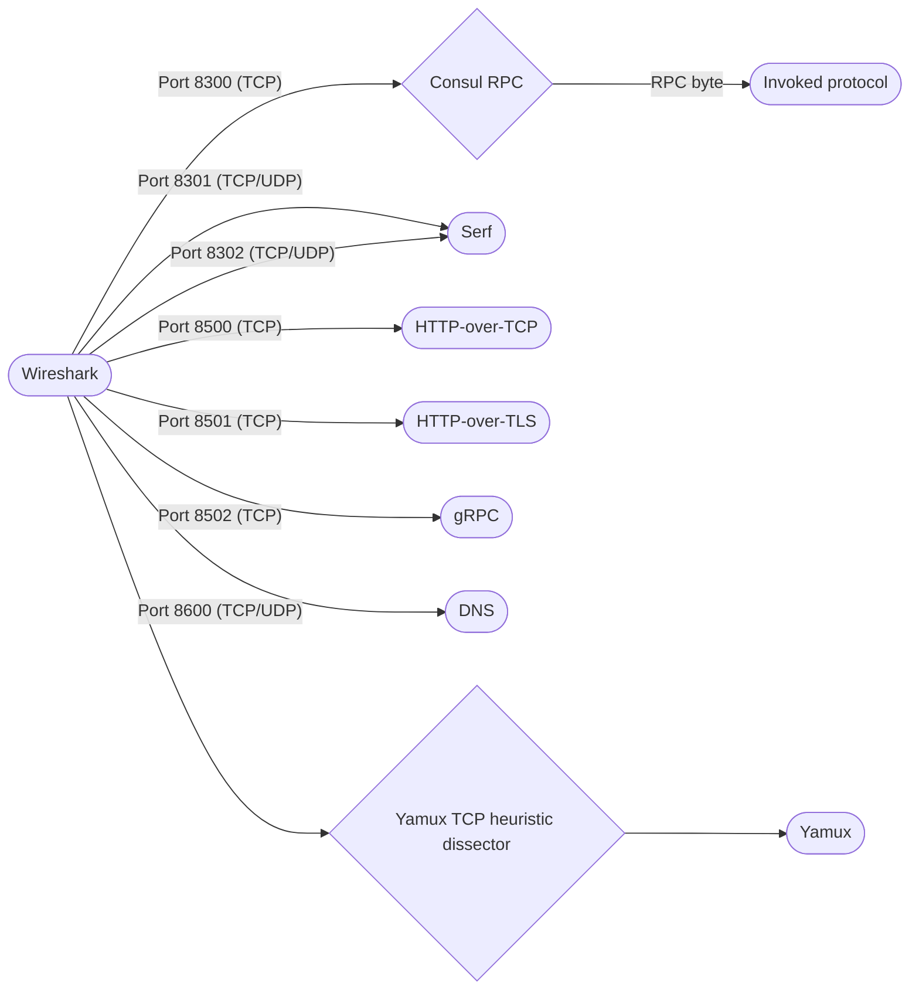
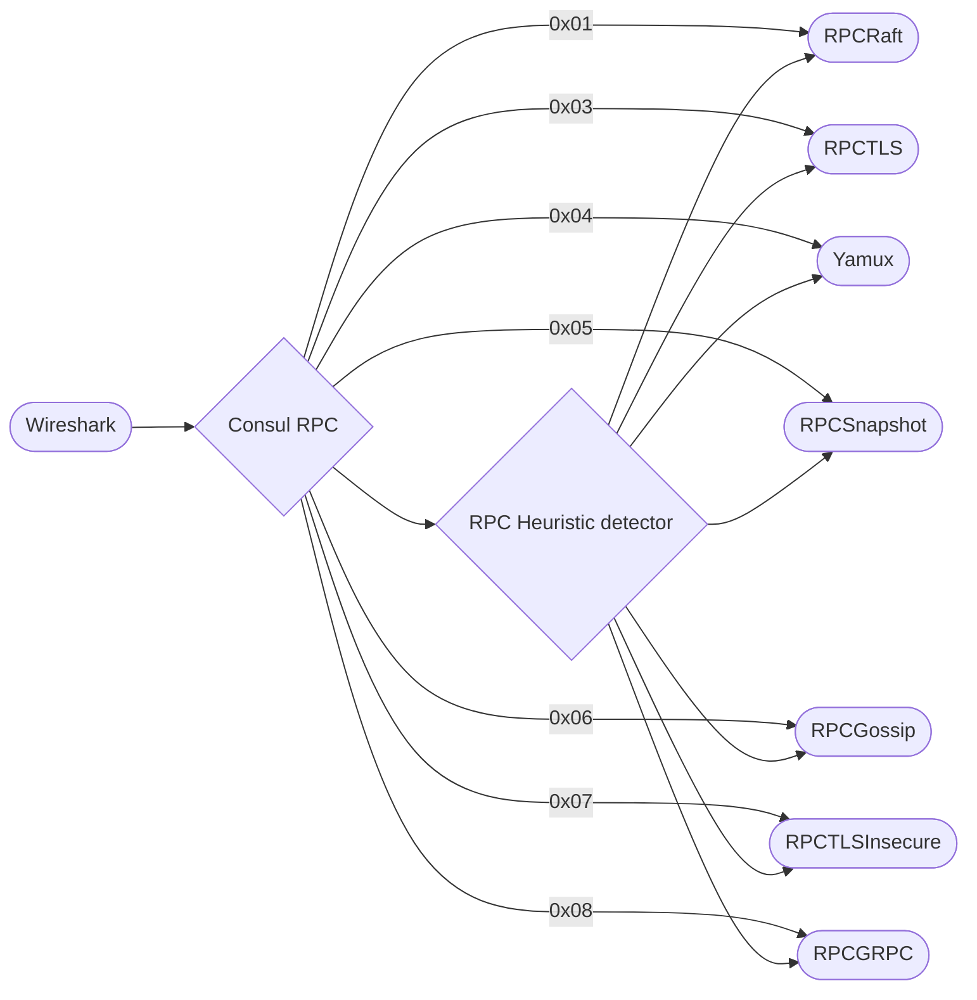
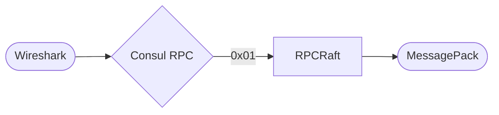
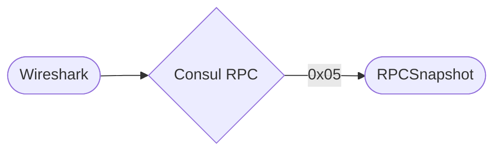
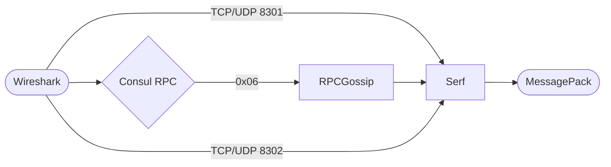

<!--
 Copyright 2022 Blake Covarrubias

 Licensed under the Apache License, Version 2.0 (the "License");
 you may not use this file except in compliance with the License.
 You may obtain a copy of the License at

     http://www.apache.org/licenses/LICENSE-2.0

 Unless required by applicable law or agreed to in writing, software
 distributed under the License is distributed on an "AS IS" BASIS,
 WITHOUT WARRANTIES OR CONDITIONS OF ANY KIND, either express or implied.
 See the License for the specific language governing permissions and
 limitations under the License.
-->

# Dissector packet flow

This plugin is comprised of three distinct protocol dissectors; Consul
(RPC identifier/router), Serf, and Yamux. These dissectors, together with several
built-in Wireshark dissectors, decode traffic related to Consul.

The following diagrams depict how packets for the supported RPC and protocol
types are identified and subsequently dissected by traversing through one or
more sub-dissectors.

## High-level routing

At a high level, the following dissectors are configured to decode traffic
received for specific protocols and/or IP ports.

## Consul RPC dissector

Consul multiplexes traffic for multiple RPC types on a single TCP port. For each
TCP session, Consul sends a one-byte packet immediately following the TCP three-way
handshake that signals the traffic type that will follow for the duration of the
TCP session. After identifying a potential RPC byte (protocol pattern), the
Consul RPC dissector will try to call a sub-dissector for that pattern to decode
the RPC byte.

In order for the RPC byte to be successfully decoded, the protocol pattern must
first be associated to a specific sub-dissector. When sub-dissectors are
initialized by Wireshark, they register the protocol pattern(s) they are capable
of decoding with the `consul.protocol` dissector table. See the `rpc_raft.init()`
function in [`src/consul/rpc_raft.lua#L119-L131`] for an example.

If a sub-dissector is found, Wireshark then execute's the dissector's `dissector()`
function to attempt to decode the packet. If sub-dissector is able to decode the
packet it notifies Wireshark to use that dissector for all remaining packets in
the conversation by setting `conversation = <dissector protocol>` on the `Pinfo`
object.

If heuristic detection is enabled (disabled by default), the dissector will
attempt to identify existing traffic in existing TCP sessions by passing packet
payloads to each sub-dissector until one returns a match.

While the majority of the RPC dissectors are called directly from the `consul`
through one of the aforementioned methods, some dissectors can be invoked
directly by other sub-dissectors. The following sections list each
sub-dissector, and the different ways that dissector can be invoked.

### RPCRaft (0x01)

The RPC Raft dissector is invoked directly from the Consul RPC dissector.

### RPCTLS (0x03) / RPCTLSInsecure (0x07)

The RPC TLS and TLS Insecure dissectors are invoked directly from the Consul RPC
dissector.

### RPCMultiplexV2 (0x04) / Yamux

The Yamux dissector can be invoked via one of two ways:

1. If heuristic detection is enabled for the Yamux dissector (default), the
   dissector will be invoked for matching TCP packets.
1. The Consul RPC dissector invokes the sub-dissector for RPC type `0x04`.

### RPCSnapshot (0x05)

The RPC Snapshot dissector is invoked directly by the Consul RPC dissector for
RPC type `0x05`.

### RPCGossip (0x06)

The RPC Gossip dissector can be invoked via one of two ways:

1. The Consul RPC dissector invokes the sub-dissector for RPC type `0x06`.
1. The Yamux dissector invokes the RPC Gossip sub-dissector if it detects that
   RPC type `0x06` is being transported in the Yamux stream.

### RPCGRPC (0x08)

The RPC gRPC dissector is invoked directly by the Consul RPC dissector for
RPC type `0x08`.

## Serf

The Serf dissector can be invoked via one of two ways:

1. Wireshark invokes the dissector for TCP and UDP traffic received on ports
   8301 (LAN Gossip) and 8302 (WAN Gossip).
1. The RPC Gossip dissector invokes the Serf sub-dissector for all packets
   following the RPC Gossip header.

<!-- Reference style links -->
[`src/consul/rpc_raft.lua#L119-L131`]: https://github.com/blake/wireshark-consul-dissector/blob/e2d7031940b6672d4a49e4cf6546c9f74ffa5ab4/src/consul/rpc_raft.lua#L119-L131
